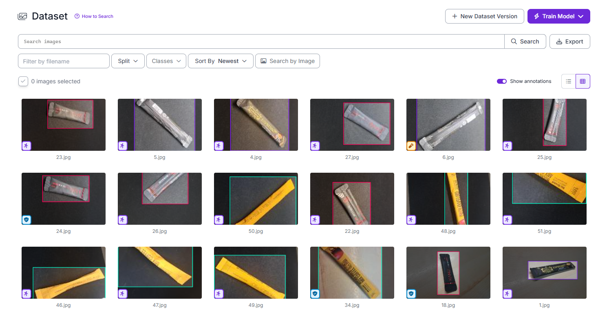

# Jetson Nano 기반 Edge AI 객체 탐지 구현 (YOLOv5)

# Implementing Edge AI Real-time Object Detection on Jetson Nano using YOLOv5


---

## 1. 개요

비전 AI 기술의 산업 현장 도입이 확대되면서, 클라우드 서버를 거치지 않고 현장 장비에서 엣지 디바이스(Edge Device)와 AI를 활용한 엣지 AI(Edge AI) 의 중요성이 커지고 있다.

해당 프로젝트는 이러한 엣지 디바이스 환경에서 제한된 연산 자원 내에 신경망 AI기반 실시간 객체 인식과 최적화를 구현하는 것을 목표로 한다.

엣지 디바이스 플랫폼은 CUDA 및 TensorRT 등 NVIDIA의 AI 생태계와 높은 접근성을 고려하여 Jetson Nano Developer Kit (4GB)을 채택하였다.

비전 AI 모델은 오픈소스 자료와 트러블슈팅 레퍼런스를 고려하여 널리 사용되는 YOLO 계열을 채택했으며, Jetson Nano 환경과의 호환성을 고려하여 YOLOv5를 사용하였다.

시스템의 PoC(Proof of Concept) 검증을 위해 3가지 종류의 커피 스틱(카누, 에스프레소 미니, 믹스커피)을 대상으로 객체 탐지 실험을 수행하였다. 직접 촬영하여 구축한 커스텀 데이터셋으로 PC 환경에서 모델을 학습시키고, 이를 엣지 디바이스에 배포 및 최적화하여 실시간 객체 탐지 파이프라인을 구현하는 전체 과정을 담고 있다.

### Demo

## 2. System Architecture

### Training & Deployment Pipeline

```
Custom Dataset
     ↓
Data Annotation (Roboflow)
     ↓
YOLOv5 Training (PC GPU)
     ↓
Model Export (ONNX)
     ↓
TensorRT Conversion (Jetson Nano)
```

### Edge AI Inference Pipeline

```
Camera (Webcam)
   ↓
Image Capture
   ↓
Image Preprocessing (Resize / Normalize)
   ↓
TensorRT Engine
   ↓
Post-processing (NMS)
   ↓
Bounding Box Rendering
   ↓
Real-time Object Detection Output
```

---

## 3. Project Structure

리포지토리는 핵심 가중치 파일과 환경 설정, 그리고 테스트를 위한 구조로 구성되어 있습니다. (YOLOv5 코어 파일 제외)

```
edge-ai-object-detection-jetson-nano-yolo
├── my_dataset\                # 커스텀 데이터셋
│   ├── train\
│   ├── valid\  
│   └── data.yaml              # 클래스 정의 및 데이터 경로 설정 파일
├── env\
│   ├── requirements_pc.txt    # PC (Windows/Conda) 환경 종속성 패키지
│   └── requirements_nano.txt  # Jetson Nano 환경 종속성 패키지
├── weights\
│   ├── best.pt                # PyTorch 원본 가중치 (학습 결과)
│   ├── best.onnx              # TensorRT 변환을 위한 공용 포맷
│   └── best.engine            # Jetson Nano 전용 최적화 엔진 (FP16)
├── assets\
└── README.md                  # 프로젝트 통합 문서
```

---

## 4. 개발 환경

### Training Environment (PC)

* **GPU:** NVIDIA RTX 3050 Laptop GPU (VRAM 4GB)
* **OS:** Windows 11
* **Python:** 3.8.20 (Conda Virtual Environment)
* **Framework:** PyTorch 2.4.1 (CUDA 11.8)
* **Model:** YOLOv5s (v6.2)

### Deployment Environment (Edge Device)

* **Device:** NVIDIA Jetson Nano Developer Kit (4GB)
* **OS:** JetPack 4.6.1
* **Python:** 3.6.9
* **Framework:** PyTorch 1.10.0 (CUDA 10.2)
* **Optimization:** TensorRT
* **WebCam**: A4TECH PK910H (USB)

---

## 5. Dataset & Annotation

### 1) 데이터셋 수집

스마트폰 카메라를 활용하여  3가지 배경(background) 과 3가지 조명 조건에서 다양한 각도로 커피 스틱 이미지를 촬영하였다.
이를 통해 실제 환경에서 발생할 수 있는조명 변화와 배경 변화를 반영하고자 하였다. 총 **51장의 이미지 데이터**를 수집하였다.

### 2) Annotation

**라벨링:**


- **Roboflow** 툴 사용
- 촬영한 51개 사진에 대해 바운딩 박스 라벨링 작업 및 클래스 지정
- 무작위 이미지 34개 Train 지정, 17개 Validation 지정
- **Classes**:
  - `KANU`
  - `espresso_mini`
  - `mix_coffee`

**Augmentation:**

- Roboflow 툴 사용
- 적은 양의 데이터셋을 보완하기 위해 다양한 설정 사용
- Augmentation 적용된 이미지로 Train 이미지 x5
- 세부 설정
  Flip: Horizontal, Vertical
  Rotation: Between -45° and +45°
  Noise: Up to 1.8% of pixels
  Mosaic: Applied
  Motion Blur: Length 20px, Angle: 0°, Frames: 1

**최종 Dataset Distribution**

* Total images: 187
* Train: 170 (91%)
* Validation (9%)

---

## 6. Model Training (PC)

### 1) 초기 세팅

- 세부 Dependency는 requirements.txt 참고
- YOLOv5 저장소 가져오기

  ```
  git clone https://github.com/ultralytics/yolov5
  cd yolov5
  ```
- 라이브러리 설치 및 호환성 해결

  ```
  pip install -r requirements.txt
  pip install "numpy<1.24"
  ```

### 2) AI 학습 (Training)

- 커스텀 데이터셋으로 학습 코드 실행
- `--img 640` : 특징(Feature) 추출 능력 극대화를 위해 최댓값 설정
- `--batch 16` : GPU 메모리 사용량과 학습 안정성을 고려하여 16 설정
- `--epochs 300` : 수집된 초기 커스텀 데이터의 양이 상대적으로 적었기 때문에, 모델이 데이터의 패턴을 충분히 파악할 수 있도록 최대 학습 횟수를 300회로 여유있게 부여

  ```
  python train.py --img 640 --batch 16 --epochs 300 --data my_dataset/data.yaml --weights yolov5s.pt
  ```
- 학습결과

  - runs/train/exp 내에 best.pt 파일 생성
  - 조기 종료(Early Stopping, patience=100)가 작동하여 182번째 에포크에서 학습이 자동 중단됨

### 3) 모델 변환 (Export)

- **.pt** ➔ **.onnx**
- 이후 best.pt를 **TensorRT** 프레임워크 형식으로 변환을 위해 중간단계로 오픈소스 공용 형식인 onnx 파일로 변환

  ```
  python export.py --weights runs/train/exp/weights/best.pt --include onnx
  ```
- 훈련이 완료된 best.pt, 변환된 best.onnx 파일 usb, 데이터셋 파일은 Jetson Nano 에 복사

---

## 7. Edge Device Deployment (Jetson Nano)

### 1) 초기 세팅

- 세부 Dependency는 requirements.txt 참고
- YOLOv5 저장소 가져오기

  ```
  git clone https://github.com/ultralytics/yolov5
  cd yolov5
  ```
- 라이브러리 설치

  ```
  pip install -r requirements.txt
  ```
- 가상 메모리 확보

  ```
  sudo fallocate -l 4G /swapfile
  sudo chmod 600 /swapfile
  sudo mkswap /swapfile
  sudo swapon /swapfile
  echo '/swapfile swap swap defaults 0 0' | sudo tee -a /etc/fstab
  ```

### 2) 최적화

- **.onnx ➔ .engine**
- 학습된 모델을 nvidia에 최적화된 **TensorRT** 프레임워크 형식으로 변환
- **양자화 (Quantization)**: 데이터 타입을 기존 FP32에서 FP16(16비트 부동소수점)으로 정밀도를 낮추어 메모리 사용량 감소 및 추론 속도 대폭 향상. 부동소수점의 길이를 줄여 연산량을 완화

  ```
  /usr/src/tensorrt/bin/trtexec --onnx=best.onnx --saveEngine=best.engine --fp16
  ```

### 3) 모델 실행

- detect.py를 통해 실시간 객체 인식 실행
- `--source 0`: 웹캠 (USB)

  ```
  python3 detect.py --weights best.engine --source 0 --img 640 --data my_dataset/data.yaml
  ```

---

## 8. Result

### 1) 실시간 객체 인식

데이터셋의 제한된 크기로 인해 정량적인 성능 평가에는 한계가 있으므로, 본 프로젝트에서는 실제 시연을 통한 정성적 평가를 통해 객체 탐지 성능을 확인하였다.

 

Jetson Nano 환경에서 실시간 객체 탐지가 정상적으로 동작함을 확인하였다.

### 2) 속도 성능 평가 (PyTorch vs TensorRT)

Jetson Nano 환경에서 val.py 통해 일반 PyTorch 모델과 TensorRT 최적화 모델의 처리 속도를 비교하였다.

**실행코드**

```
# best.pt (PyTorch)
python3 val.py --weights best.pt --data my_dataset/data.yaml --img 640 --batch-size 1

# best.engine (TensorRT)
python3 val.py --weights best.engine --data my_dataset/data.yaml --img 640 --batch-size 1
```

**속도 비교**

| 모델 형식             | 환경                        | 해상도  | Preprocess | Inference         | Postprocess | FPS     |
| :-------------------- | :-------------------------- | :------ | :--------- | :---------------- | ----------- | ------- |
| YOLOv5s (`.pt`)     | Jetson Nano (PyTorch)       | 640x640 | 35.1ms     | **219.8ms** | 55.6ms      | 3.2 FPS |
| YOLOv5s (`.engine`) | Jetson Nano (TensorRT FP16) | 640x640 | 10.0ms     | **85.3ms**  | 43.1ms      | 7.2 FPS |

TensorRT 형식으로의 변환과 양자화를 통해 처리속도가 3.2FPS에서 7.2FPS로 유의미하게 증가된 것을 확인 할 수 있다. 세부적으로는 Preprocess나 Postprocess는 CPU가 주로 담당하는 일이라 변화가 적었지만,  연산작업이 큰 Inference 부분에서 시간이 **219.8ms**에서 **85.3ms**로 약 2.5배 개선되었다.

---

## 9. Troubleshooting

**의존성(Dependency) 및 버전 호환성 충돌**

* **[PC 환경]** YOLOv5(v6.2)와 최신 버전의 NumPy(v2.x) 간의 호환성 충돌로 인한 에러가 발생하여 NumPy 버전을 `1.24` 미만으로 명시적 다운그레이드를 통해 해결하였다.
* **[Edge 환경]** Jetson Nano의 제한된 OS 환경(JetPack 4.6.1)에서 최신 `ultralytics` 통합 라이브러리 설치 시 의존성 꼬임 문제가 발생했다.  PyTorch, torchvision, OpenCV 등 필요한 라이브러리를 개별적으로 설치하는 방식으로 해결하였다. 이후에도 일부 의존성 문제로 인해 라이브러리 버전을 조정하거나 YOLOv5 내부 Python 파일을 일부 수정을 통해 문제를 해결하였다.

**Windows 페이징 파일 메모리 부족 (`WinError 1455`):**

- PC 학습 단계에서 PyTorch DataLoader의 멀티프로세싱 과정 중 시스템 RAM이 고갈되는 현상이 발생하였다. 가상 메모리(Paging file)를 32GB로 증설하여 해결하였다.

**Jetson Nano 메모리 부족**

- `val.py`를 통한 성능 측정 중  `.pt` 모델 로드 시, 배치 크기로 인해  메모리 부족으로 측정이 중단되는 현상이 지속되었다.  `--batch-size 1` 옵션을 강제하여 한 번에 하나의 이미지만 처리하도록 설정하였다.

## 10. Limitation

**제한적인 데이터셋 규모**

- 해당 프로젝트에서 사용한 커스텀 데이터셋은 총 187장의 이미지로 구성되어 있다. 모델 학습 관점에서 볼 때 데이터 규모가 충분히 크지 않기 때문에 모델의 일반화 성능(Generalization)에 한계가 있을 수 있다. 또한 데이터셋 규모가 제한적이기 때문에 과적합(Overfitting)이 발생할 가능성이 존재한다.
- 데이터셋의 규모가 제한적이기 때문에 정확도에 대한 신뢰도 높은 정량적 평가를 수행하기 어려운 측면이 존재한다. 따라서 본 프로젝트에서는 모델 성능을 Jetson Nano 환경에서의 실시간 시연을 통한 정성적 평가 중심으로 확인하였다.

 **Jetson Nano 하드웨어 성능 한계**

- Jetson Nano는 임베디드 AI 개발 보드 기준으로는 준수한 성능을 제공하지만, Edge AI 관점에서는 비교적 구형 플랫폼에 해당한다. 2019년에 출시된 하드웨어로 GPU 성능과 메모리(4GB)의 제약이 존재한다.
- 연산량이 많은 최신 딥러닝 모델이나 대형 모델(예: **YOLOv5x**)을 적용하기에는 성능 및 메모리 측면에서 제한이 있다.

**Jetson Nano의 소프트웨어 호환성 제약**

- Jetson Nano는 JetPack 4.6.x 에서 공식 지원이 멈춰 있다. 최신 AI 프레임워크(PyTorch 2.x 이상)나 최신 파이썬 버전(3.10 이상) 사용 제약이 크며, 하위 호환성을 맞추기 위한 환경 구축에 많은 비용(시간)이 소모된다.

**제한적인 참고 자료**

- Jetson Nano는 출시 이후 시간이 지난 플랫폼이기 때문에 최근 Edge AI 플랫폼(예: Jetson Orin 시리즈)에 비해 최신 개발 사례나 참고 자료가 상대적으로 제한적이다.
- 환경 설정 및 문제 해결 과정에서 시행착오가 발생할 수 있으며, 개발 과정이 다소 복잡해질 수 있다.

## 11. Conclusion

해당 프로젝트에서는 제한된 연산 자원을 가진 엣지 디바이스 환경에서 실시간 객체 탐지 시스템을 구현하기 위해 Jetson Nano와 YOLO를 기반으로 Edge AI 객체 인식 파이프라인을 설계하고 구축하였다.

커스텀 데이터셋을 직접 수집하고 Roboflow를 이용해 라벨링 및 Augmentation을 수행한 후, YOLOv5s 모델을 기반으로 PC 환경에서 학습을 진행하였다. 이후 학습된 모델을 ONNX 형식으로 변환하고 Jetson Nano 환경에서 TensorRT 엔진으로 최적화하여 실제 엣지 디바이스에서 동작 가능한 실시간 객체 탐지 시스템을 구현하였다.

실험 결과 Jetson Nano에서 기본 PyTorch 모델을 사용할 경우 약 3.2 FPS의 처리 속도를 보였으며, TensorRT FP16 최적화를 적용한 경우 7.2 FPS까지 향상되어 성능 개선을 확인하였다. 특히 연산량이 가장 큰 Inference 단계에서 처리 시간이 약 2.5배 감소하여 TensorRT 최적화 및 양자화 적용은 엣지 환경에서 매우 효과적인 방법임을 확인할 수 있었다.

또한 본 프로젝트를 통해 제한된 메모리 환경, 프레임워크 버전 호환성 문제, Jetson Nano의 구형 소프트웨어 스택과 같은 다양한 Edge AI 환경의 현실적인 제약을 경험하고 이를 해결하는 과정을 수행하였다. 이러한 과정은 단순한 모델 학습을 넘어 AI 모델을 실제 하드웨어 환경에 배포하고 운영하는 Edge AI 시스템 구현 과정 전반을 이해하는 데 중요한 경험이 되었다.

해당 프로젝트를 통해 Edge Device 환경에서도 딥러닝 기반 객체 탐지 시스템을 실제로 구현하고 최적화할 수 있음을 확인하였다. 이는 공부중인 PLC 제어와 함께 향후 하드웨어 제어 및 산업 자동화 시스템으로 확장하기 위한 기술적 토대가 되었다.

## 12. Future Work

**GPIO 핀을 통한 PLC 연동 (Hardware Control):**

- Jetson Nano의 GPIO 핀을 활용하여 특정 객체 인식시 Digital Out 신호 출력
- 이 신호를 PLC와 연동하여 실무에 초첨을 둔 자동화 시스템 구현

**CSI 카메라 및 내장 ISP를 활용한 추가 최적화**

- USB 웹캠 기반 영상 입력 방식을 CSI 인터페이스를 지원하는 카메라 센서로 교체
- CSI 카메라 모듈 사용시 영상 데이터를 CPU 대신 Jetson Nano에 내장된 ISP 칩에서 처리가능 (CPU Offloading)

**데이터 수집 파이프라인 구축**

- 기존 방식에서 더 효율적인으로 양질의 대량 데이터셋 수집 파이프라인 구축
- 동영상에서 프레임 단위로 이미지를 자동 추출하는 스크립트 방식 구현
